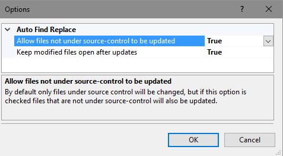
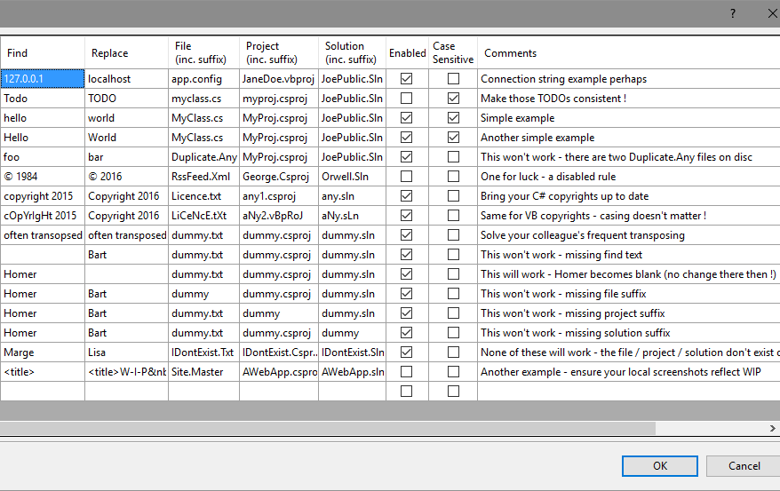
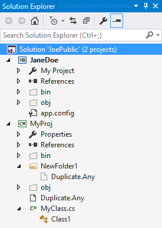
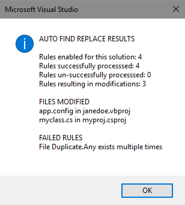

# AutoFindReplace

<!---->
<!---->
<!---->

Download this extension from the [VS Marketplace](https://marketplace.visualstudio.com/items?itemName=GregTrevellick.AutoFindReplace).

---------------------------------------

<!--COPY START FOR VS GALLERY-->

This Visual Studio extension will automatically find and replace specified text within specified files when a solution is opened.

The intention is to eliminate repetitive manual code modifications that a developer may find neccessary for certain Visual Studio solutions.

With this extension installed Visual Studio will automatically perform a find/replace action on specified file(s) within a specified project upon opening a named solution.

If you like this *free* extension, please give it a [review](https://marketplace.visualstudio.com/items?itemName=GregTrevellick.AutoFindReplace#review-details).

See the [change log](CHANGELOG.md) for road map and release history. Bugs can be logged [here](https://github.com/GregTrevellick/AutoFindReplace/issues).

## Example

The following options settings:

For the following solution:

Result in the following outcome when opened:

## Who Is This Extension For ?

Any developer using the Visual Studio IDE (any language, any file type) who currently needs to keep repeatedly making the same manual code change(s) to the same file(s) because:

 - It is not possible for the change(s) to be persisted indefinately in the developer's source control repository, for any reason

 and / or

 - It is not possible for the change(s) to be persisted durably in the developer's local file system, for any reason

## Use-Cases

 - Your source-control system freakishly doesn't retained a file's modifications, and so every time you open a new branch of your solution you need to manually and repeatedly make the same changes to address this. *This was the real-life problem I experienced that inspired me to create this extension.*
 
 - Every time you open a new branch of your solution you open one or more files and manually and repeatedly comment out particular lines of code (e.g. you change 'debugger;' to '//debugger;').
 
 - You and a colleague or contributor constantly commit changes that revert the other's previous commit. As a result whenever you open the solution you manually and repeatedly edit the same file (e.g. you change 'Author: Joe Public' to 'Author: Jane Doe').
  
 - You have an app.config (or web.config) file, and every time you open a new branch of your solution you need to manually and repeatedly change the connection string from a shared server to localhost, alter a password, change a URL or port number that your app accesses.

 - You have a Master Page, and every time you open a new branch of your solution you manually and repeatedly change the page header to contain a phrase such as "Local Work-In-Progress" to aid user interpretation of any screen shots you produce.
  
 - Many more. *If you have a use-case you would like listed here, just let me know via a review on the [VS Gallery](https://marketplace.visualstudio.com/items?itemName=GregTrevellick.AutoFindReplace#review-details).*
 
## Features

- Modifications can be limited to files under source control only. This is the default setting, but can be overridden to allow non-source controlled files to be modified.

- Modified files will not remain open in the IDE Editor by default, but this can be changed to keep files open.

- Define multiple rules for the same file, or for different files in multiple projects / solutions. 

- Each rule for finding and replacing text can be enabled or disabled individually, allowing a rule to be temporarily ineffective without having to delete the rule.

- Text searching on a case-insensitive or case-sensitive basis, defined at individual rule level.

- Rules can have free-text comments added, for your own notes as to why you need the rule. 

- Each rule has a plain-English auto-generated summary explanation.

- If a solution is opened whose name matches a rule, user is shown a summary of any modifications made. This summary can be surpressed if no modifications were made.

- Incomplete rules (e.g. without a file name) can be specified, and will simply be ignored when specified the solution is opened. 

- Rules can be exported (JSON or CSV format) to clipboard, for sharing amongst colleagues or across different PCs.

<!--COPY END FOR VS GALLERY-->

## Contribute

Contributions to this project are welcome by raising an [Issue](https://github.com/GregTrevellick/AutoFindReplace/issues) or submitting a [Pull Request](https://github.com/GregTrevellick/AutoFindReplace/pulls).

A zip file containing the sample JoePublic.Sln (used for sample screen shots) has been made available [here](https://github.com/GregTrevellick/AutoFindReplace/blob/master/JoePublic.zip).

The rules specified in the example screen shots above can be implemented locally by setting the 'applyTestRules' property of [RulesHelper.cs](https://github.com/GregTrevellick/AutoFindReplace/blob/master/AutoFindReplace/Helpers/RulesHelper.cs) to 'true'.

## License

[MIT](/LICENSE.txt)

## Credits

The following authors / articles deserve special mention for their help whilst creating this extension:

[Mads Kristensen](https://channel9.msdn.com/Events/Build/2016/B886)

[Joshua Thompson](http://schmalls.com/2015/01/19/adventures-in-visual-studio-extension-development-part-2)

[Slaks.Blog](http://blog.slaks.net/2013-11-10/extending-visual-studio-part-2-core-concepts/)

[Paul Betts](https://github.com/paulcbetts/SaveAllTheTime)

[Daniel Schroeder](http://blog.danskingdom.com/category/visual-studio-extensions/)

[Sho Sato](https://vsmarketplacebadge.apphb.com/)
